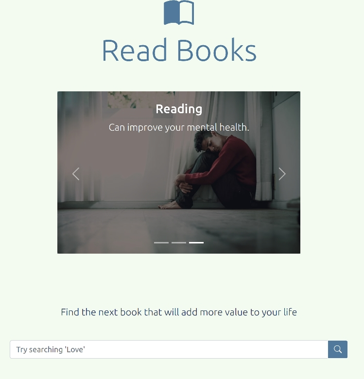

<div id="top"></div>
<!-- PROJECT LOGO -->
<br />
<div align="center">
  <a href="https://github.com/furawa/readBooks">
    
  </a>

<h3 align="center">Read Books Daily</h3>

  <p align="center">
    A simple app that fetch books from an url based on a choosen subject.   
    The app will visualize the books available in that category.      
    The user can visualize the description of each book by clicking a button. 
    <br />
    <a href="https://readbooks-daily.netlify.app">View Demo</a>
    ·
    <a href="https://github.com/furawa/readBooks/issues">Report Bug</a>
    ·
    <a href="https://github.com/furawa/readBooks/issues">Request Feature</a>
  </p>
</div>


<!-- TABLE OF CONTENTS -->
<details>
  <summary>Table of Contents</summary>
  <ol>
    <li>
      <a href="#about-the-project">About The Project</a>
      <ul>
        <li><a href="#built-with">Built With</a></li>
      </ul>
    </li>
    <li>
      <a href="#getting-started">Getting Started</a>
      <ul>
        <li><a href="#prerequisites">Prerequisites</a></li>
        <li><a href="#installation">Installation</a></li>
      </ul>
    </li>
    <li><a href="#usage">Usage</a></li>
    <li><a href="#contributing">Contributing</a></li>
    <li><a href="#license">License</a></li>
    <li><a href="#contact">Contact</a></li>
    <li><a href="#acknowledgments">Acknowledgments</a></li>
  </ol>
</details>

<!-- ABOUT THE PROJECT -->
## About The Project  
<div align="center">
  <a href="https://readbooks-daily.netlify.app">
    
  </a>
</div>
<p align="right">(<a href="#top">back to top</a>)</p>

### Built With

* [JavaScript](https://www.w3schools.com/js/)
* [HTML](https://www.w3schools.com/html/)
* [CSS](https://www.w3schools.com/css/)
* [Bootstrap](https://getbootstrap.com)
* [Bootstrap-icons](https://icons.getbootstrap.com/)

<p align="right">(<a href="#top">back to top</a>)</p>

<!-- GETTING STARTED -->
## Getting Started

To get a local copy up and running follow these simple example steps.

### Prerequisites

* npm
  ```sh
  npm install npm@latest -g
  ```

### Installation

1. Clone the repo
   ```sh
   git clone https://github.com/furawa/readBooks.git
   ```
2. Install NPM packages
   ```sh
   npm install
   ```
3. Create an .env file and add these values
   ```
   COVER_URL=https://covers.openlibrary.org/b/id
   BOOK_URL=https://openlibrary.org
   ```

<p align="right">(<a href="#top">back to top</a>)</p>


<!-- USAGE EXAMPLES -->
## Usage

```sh
npm run dev
```
```sh
npm run build
```

<p align="right">(<a href="#top">back to top</a>)</p>

<!-- CONTRIBUTING -->
## Contributing

Contributions are what make the open source community such an amazing place to learn, inspire, and create. Any contributions you make are **greatly appreciated**.

If you have a suggestion that would make this better, please fork the repo and create a pull request. You can also simply open an issue with the tag "enhancement".
Don't forget to give the project a star! Thanks again!

1. Fork the Project
2. Create your Feature Branch (`git checkout -b feature/AmazingFeature`)
3. Commit your Changes (`git commit -m 'Add some AmazingFeature'`)
4. Push to the Branch (`git push origin feature/AmazingFeature`)
5. Open a Pull Request

<p align="right">(<a href="#top">back to top</a>)</p>


<!-- LICENSE -->
## License

Distributed under the MIT License. See `LICENSE.txt` for more information.

<p align="right">(<a href="#top">back to top</a>)</p>


<!-- CONTACT -->
## Contact
email: frankenprofessional@gmail.com  
Project Link: [https://github.com/furawa/readBooks](https://github.com/furawa/readBooks)

<p align="right">(<a href="#top">back to top</a>)</p>

<!-- ACKNOWLEDGMENTS -->
## Acknowledgments

* [https://openlibrary.org/](https://openlibrary.org/)

<p align="right">(<a href="#top">back to top</a>)</p>


<!-- MARKDOWN LINKS & IMAGES -->
<!-- https://www.markdownguide.org/basic-syntax/#reference-style-links -->
[contributors-shield]: https://img.shields.io/github/contributors/furawa/readBooks.svg?style=for-the-badge
[contributors-url]: https://github.com/furawa/readBooks/graphs/contributors
[forks-shield]: https://img.shields.io/github/forks/furawa/readBooks.svg?style=for-the-badge
[forks-url]: https://github.com/furawa/readBooks/network/members
[stars-shield]: https://img.shields.io/github/stars/furawa/readBooks.svg?style=for-the-badge
[stars-url]: https://github.com/furawa/readBooks/stargazers
[issues-shield]: https://img.shields.io/github/issues/furawa/readBooks.svg?style=for-the-badge
[issues-url]: https://github.com/furawa/readBooks/issues
[license-shield]: https://img.shields.io/github/license/furawa/readBooks.svg?style=for-the-badge
[license-url]: https://github.com/furawa/readBooks/blob/master/LICENSE.txt
[linkedin-shield]: https://img.shields.io/badge/-LinkedIn-black.svg?style=for-the-badge&logo=linkedin&colorB=555
[linkedin-url]: https://linkedin.com/in/linkedin_username
